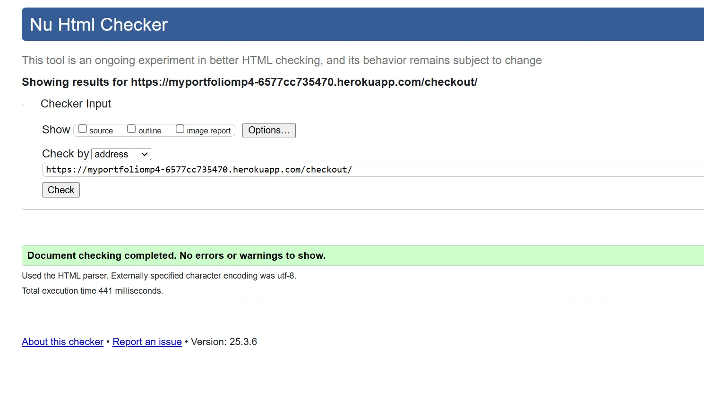
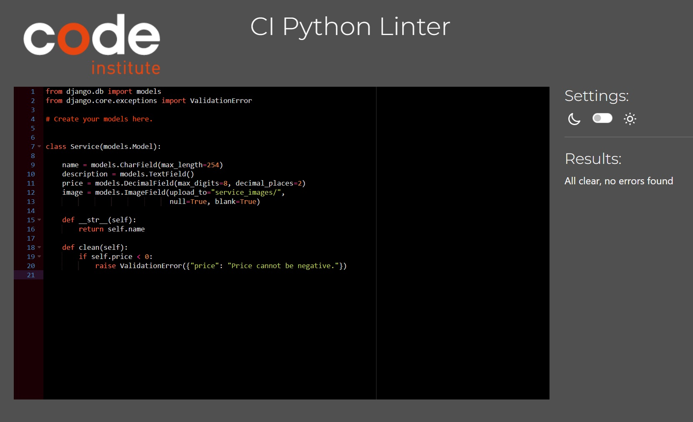
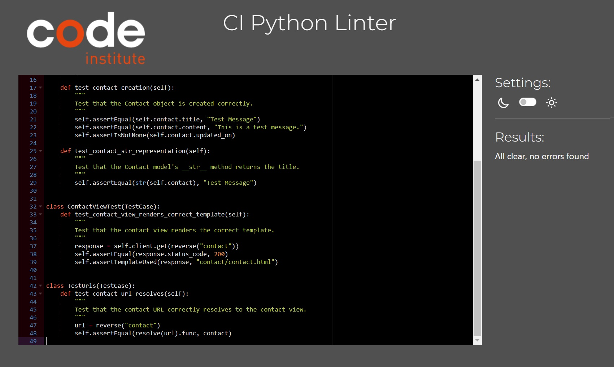
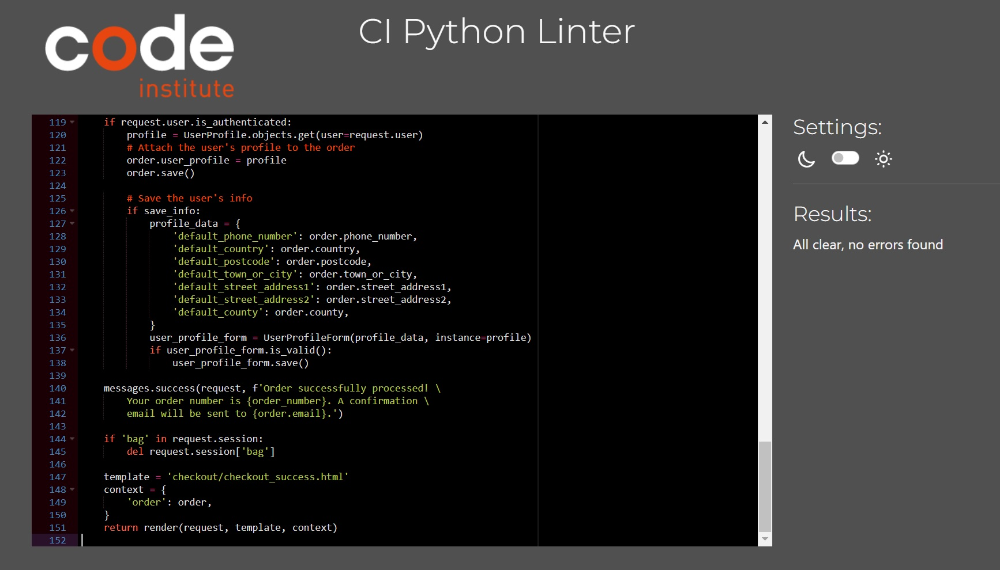
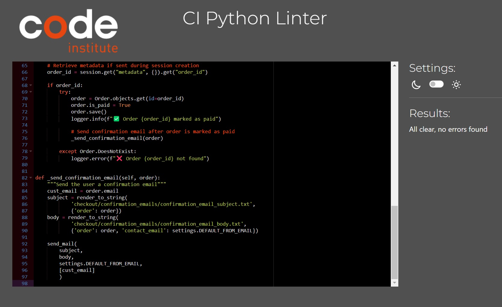
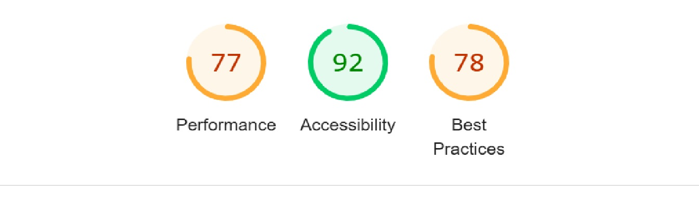

# TABLE OF CONTENT

1. [ Manual Testing ](#manual)
2. [ Automated Testing ](#auto)
3. [ Bugs and Fixes ](#bugs)

# MANUAL TESTING 

### Testing Responsiveness

| **Feature** | **Test Method** | **Expectation** | **Outcome** |
|-------------|-----------------|-----------------|-------------|
| Header Responsivness | Developer Tools: 320px/375px/425px/768px/1024px/1440px | Fully Responsive Layout | PASS |
| Footer Responsiveness | Developer Tools: 320px/375px/425px/768px/1024px/1440px | Fully Responsive Layout| PASS |
| Home Page | Developer Tools: 320px/375px/425px/768px/1024px/1440px | Fully Responsive Layout| PASS |
| Portfolio Page | Developer Tools: 320px/375px/425px/768px/1024px/1440px | Fully Responsive Layout| PASS |
| Service Page | Developer Tools: 320px/375px/425px/768px/1024px/1440px | Fully Responsive Layout| PASS |
| Contact Page | Developer Tools: 320px/375px/425px/768px/1024px/1440px | Fully Responsive Layout| PASS |
| Service_details Page | Developer Tools: 320px/375px/425px/768px/1024px/1440px | Fully Responsive Layout| PASS |
| Bag Page | Developer Tools: 320px/375px/425px/768px/1024px/1440px | Fully Responsive Layout| PASS | 
| Checkout Page | Developer Tools: 320px/375px/425px/768px/1024px/1440px | Fully Responsive Layout| PASS | 
| Checkout_success | Developer Tools: 320px/375px/425px/768px/1024px/1440px | Fully Responsive Layout| PASS | 
| Profile Page | Developer Tools: 320px/375px/425px/768px/1024px/1440px | Fully Responsive Layout| PASS | 
| Project Page | Developer Tools: 320px/375px/425px/768px/1024px/1440px | Fully Responsive Layout| PASS | 
| About Page | Developer Tools: 320px/375px/425px/768px/1024px/1440px | Fully Responsive Layout| PASS |
| Tech Page | Developer Tools: 320px/375px/425px/768px/1024px/1440px | Fully Responsive Layout| PASS | 

### Testing Functionality of Buttons/Links

| **Feature** | **Test Method** | **Expectation** | **Outcome** |
|-------------|-----------------|-----------------|-------------|
| Navigation Links - Home | Click on link | Route to relevent page | PASS |
| Navigation Links - Portfolio | Click on link | Route to relevent page | PASS |
| Navigation Links - Services | Click on link | Route to relevent page | PASS |
| Navigation Links - Contact | Click on link | Route to relevent page | PASS |
| Navigation Links - Accounts | Click on link/icon | Route to relevent page | PASS |
| Navigation Links - Shopping Bag | Click on link/icon | Route to relevent page | PASS |
| Accounts Link/Icon suboption - MyProfile | Click on link | Route to relevent page | PASS |
| Accounts Link/Icon suboption - Login | Click on link | Route to relevent page | PASS |
| Accounts Link/Icon suboption - Logout | Click on link | Route to relevent page | PASS |
| Accounts Link/Icon suboption - Register | Click each link | Route to relevent page | PASS |
| Home - Services | Click on link | Route to relevent page | PASS |
| Home - Portfolio | Click on link | Route to relevent page | PASS |
| Home - Contact | Click on link | Route to relevent page | PASS |
| Portfolio - Project | Click on link | Route to relevent page | PASS |
| Portfolio - About | Click on link | Route to relevent page | PASS |
| Portfolio - Tech | Click on link | Route to relevent page | PASS |
| Service - Each uploaded image | Click on each uploaded Service | Take to service_details | PASS |
| Service_details - Image | Click on Service image | open image in new tab | PASS |
| Service - back | Click on button | Take back to services | PASS |
| Service - add to bag | Click on button | add item to shopping cart | PASS |
| Projects - view repo | Click on button | take to relevent github repo | PASS |
| Projects - view project | Click on button | take to live project website | PASS |
| Projects - comments | Click on button | expand div to display comments | PASS |
| Projects - edit | Click on button | edit an existing comment | PASS |*
| Projects - delete | Click on button | delete comment | PASS |
| Projects - post comment | Click on button | content written in form is posted as comment | PASS |
| About - email link | Click on link | open up blank email addressed to my e-mail | PASS |
| About - linkedin link | Click on link | open up LinkedIn | PASS |
| Bag - keep shopping | Click on button | back to services | PASS |
| Bag - secure checkout | Click on button | proceed to checkout | PASS |
| Bag - decrease quantity button | Click on button | decrease amount displayed | PASS |
| Bag - increase quantity | Click on button | increase amount displayed | PASS |
| Bag - update | Click on button | update quantity, total | PASS |
| Bag - remove | Click on button | remove item from shopping cart | PASS |
| Checkout - adjust bag | Click on button | take back to shopping cart | PASS |
| Checkout - complete order | Click on button | process payment provided form validation passed | PASS |
| Footer - email | clcik on e-mail address | open email , ready to be sent to addresee | PASS |
| Footer - icons | click on each icon | open it in new tab | PASS |
| Footer - CV | click on download icon | download CV | PASS |

-*: edit button dosen't automatically takes the user back to the comment, however feature is functonal - listed for future upgrade

### Form Validation testing

| **Feature** | **Test Method** | **Expectation** | **Outcome** |
|-------------|-----------------|-----------------|-------------|
| Contact Form | Enter invalid input: No Title | No submission allowed - "Please fill in this field response" | PASS |
| Contact Form | Enter invalid input: No Content | No submission allowed - "Please fill in this field response" | PASS |
| Contact Form | Enter valid input | Submission allowed - "confirmation feedback" | PASS |
| Service_details - quantity input | click decrease/increase to reach 0/100 | no change in input | PASS |
| Service_details - quantity manual input | Enter invalid input | quantity autoatically adjusted to an accepted value | PASS |
| bag.html - quantity input | click decrease/increase to reach 0/100 | no change in input | PASS |
| bag.html - quantity manual input | Enter invalid input | quantity autoatically adjusted to an accepted value | PASS |
| Checkout.html Form | No input in fields/test them all individually | No submission allowed - "Please fill in this field response" | PASS |
| Checkout.html Card | no input | No submission allowed - "Your card number is incomplete" | PASS |
| Checkout.html Card | no date input | No submission allowed - "Your expiry date is incomplete" | PASS |
| Checkout.html Card | no security code input | No submission allowed - "Your security code is incomplete" | PASS |
| Checkout.html Card | no post code input | No submission allowed - "Your postal code is incomplete" | PASS |

### Browser Testing

| **Feature** | **Test Method** | **Expectation** | **Outcome** |
|-------------|-----------------|-----------------|-------------|
| Google Chrome | non scripted test of features on desktop | full functionality and compatibility with browser | PASS |
| Google Chrome | non scripted test of features on mobile | full functionality and compatibility with browser | PASS |
| Microsoft Edge | non scripted test of features on desktop | full functionality and compatibility with browser | PASS |
| Microsoft Edge | non scripted test of features on mobile | full functionality and compatibility with browser | PASS |
| Samsung Internet | non scripted test of features on mobile | full functionality and compatibility with browser | PASS |

# AUTOMATED TESTING 

### HTML,CSS and JS validation

W3C validators used for HTML and CSS and JsHint is used to validate JAvaScript.

#### HTML VALIDATION:    
    
-   
 
 index.html 

    
    

-   
 
 portfolio.html 

    
    

-   
 
 tech.html 

    
    Section element was replaced with div to clear warning.

    
 
 Warning 

    
    

    
 
 Fixed 

    
    

    

-   
 
 about.html 

    
    

-   
 
 project.html 

    
    

-   
 
 contact.html 

    
    

-   
 
 service.html 

    
    

-   
 
 service_details.html 

    
    Service-btn id removed and replaced with class on relevent elements.

    
 
 Error 

    
    

    
 
 Fixed 

    
    

    

-   
 
 bag.html 

    
    

-   
 
 checkout.html 

    
    

-   
 
 checkout_success.html 

    
    

-   
 
 profile.html 

    
    Error was due to the need of authentication prevent the validator from fetching the data. Used direct input to go around this problem.

    
 
 Error 

    
    

    
 
 Fixed 

    
    

    

#### CSS VALIDATION: 
    
-   
 
 base.css 

    
    

-   
 
 checkout.css 

    
    

#### JavaScript VALIDATION: 

-   
 
 base.html 

    
    

    1. JSHint does not inherently know about Bootstrap, so it assumes bootstrap is an undeclared variable.

-   
 
 base.js 

    
    

-   
 
 quantity_input_script.html 

    
    

-   
 
 quantity_input_script.html / additional js added to handle manual inputs 

    
    

-   
 
 project.html 

    
    

-   
 
 stripe_elements.js 

    
    

    1. Stripe JS Library link is included in base.html

-   
 
 bag.html 

    
    

    

#### PEP8 , python validation:

Common issues were rectified in each file before validation:
    1. line too long  -  no line should exceed 79 characters, adhering to PEP8.
        - there are a few exception , where issue was kept to maintain readability of the code and to avoid introducing errors.
    2. no new line at the end of the file
    2. trailing whitespace

Unexpected errors:
    1. had to redo line 38 at checkout, models.py as splitting the row to comply with pep8 caused the tests to fail.
    - no further investigation took place at this time as pep8 error had no immediate effect on the overall project.

-   
 
 SERVICES APP 

    
    
 
 Model 

    
    

    
 
 View 

    
    

    
 
 Urls 

    
    

    
 
 Tests 

    
    

    

-   
 
 PROFILES APP 

    
    
 
 Model 

    
    

    
 
 View 

    
    

    
 
 Urls 

    
    

    
 
 Tests 

    
    

    
 
 TestForms 

    
    

    
 
 Forms 

    
    

    

-   
 
 PORTFOLIO APP 

    
    
 
 Model 

    
    

    
 
 View 

    
    

    
 
 Urls 

    
    

    
 
 Tests 

    
    

    

-   
 
 HOME APP 

    
 
 View 

    
    

    
 
 Urls 

    
    

    
 
 Tests 

    
    

    

-   
 
 CONTACT APP 

    
    
 
 Model 

    
    

    
 
 View 

    
    

    
 
 Urls 

    
    

    
 
 Tests 

    
    

    
 
 TestForms 

    
    

    
 
 Form 

    
    

    

-   
 
 COMMENTS APP 

    
    
 
 Model 

    
    

    
 
 Urls 

    
    

    
 
 Tests 

    
    

    
 
 TestForms 

    
    

    
 
 Form 

    
    

    

-   
 
 CHECKOUT APP 

    
    
 
 Model 

    
    

    
 
 View 

    
    

    
 
 Urls 

    
    

    
 
 Tests 

    
    

    
 
 TestForms 

    
    

    
 
 Form 

    
    

    
 
 Signals 

    
    

    
 
 Webhooks 

    
    

    

-   
 
 BAG APP 

    
    
 
 View 

    
    

    
 
 Urls 

    
    

    
 
 Tests 

    
    

    
 
 Context 

    
    

    

## Lighthouse 

    Initial test result were a lot lower than expected. There is a general mid-range, 78% score on best practises accross the site ,mainly due to third party (Stripe) cookies.
    I decided not to address this for the time being as Stripe functionality is key and priority in this project.

    Accessibility scores 100% in most, above 90% for the rest but 1 page. bag.html flags no alt attributes and no accessible names, however upon changing these the warnings did persist and therefore this will need to be investigated further.

    Performance is generally good accross the site with some pages falling in the needs improvement range( 50% - 89% ). I have coverted most images to increase performance from jpeg to webp. Also, included rel=preload and fetchpriority=high links at the <head> for css files and profile image. This had some improvement ,however a few of the site's pages still flaging the issue and needs looking into it more in depth.

-   
 
 All lighthouse testing  

    
    
 
 home 

    
    

    
 
 portfolio 

    
    

    
 
 project 

    
    

    
 
 about 

    
    

    
 
 tech 

    
    

    
 
 contact 

    
    

    
 
 service 

    
    

    
 
 service_details 

    
    

    
 
 bag 

    
    

    
 
 checkout 

    
    

    
 
 checkout_success 

    
    

    
 
 profile 

    
    

    

## Django Automated Tests

- Django's Testing library was used to test Projects's forms,models,views and urls. Corresponding PEP8 validation listed in PEP8 section above.

1. 
 
 Services APP 

    
    
 
 Services 

    
    

    
 
 Test Error 

    
    

    
 
 Solution 

    code added to Service model to make sure no negative value is allowed on service price.
        def clean(self):
        if self.price < 0:
            raise ValidationError({"price": "Price cannot be negative."})
    

    

2. 
 
 Profiles APP 

    
    

3. 
 
 Portfolio APP 

    
    

4. 
 
 Home APP 

    
    

5. 
 
 Contact APP 

    
    

6. 
 
 Comments APP 

    
    

7. 
 
 Checkout APP 

    
    

8. 
 
 Bag APP 

    
    

# Bugs and Fixes 

Bugs found/Minor fixes during development:

1. footer dosn't stay at the bottom of the view and displaced when content isn't filling in the entire view.

-   
 
 Image of issue 

    
    

- solution: set <footer> elements position to relative and then used javascript to posititon footer absolute to the bottom when content isn't filling in the view.

2. Displaced footer element when dropdown opens on smaller devices (tech.html).

-   
 
 Image of issue 

    
    

- solution: vh-100 bootstrap class removed has solved the issue.

3. Webhook handler did not work during development with local listener set up:

-   
 
 Image of issue 

    
    

-   
 
 Image of issue 

    
    

-   
 
 Image of issue 

    
    

-   
 
 Image of issue 

    
    

-   
 
 Image of issue 

    
    

- solution: after a throughout investigation where I checked my checkout views, urls and webhooks.py for errors followed by making sure the local listener is connected and listening on stripe and checking the events( where payments appeared succesfully) I eventually found that the stripe listener in the cli was triggered with an incorrect path.
The correct trigger is stripe listen --forward-to localhost:8000/checkout/stripe/webhook/ while during development the 
 stripe listen --forward-to localhost:8000/stripe/webhook/ path was used resulting in the 404 error.

4. Order confirmation page does not show the total cost of the order:

investigating this I found that a variable was called incorrectly.

-   
 
 Image of issue 

    
    

-   
 
 Image of issue 

    
    

- solution: order.total was changed to order.order_total to reference the variable correctly.

5. Home Page and Portfolio main sections are out of alignment and text overflowing on smaller devices:

-   
 
 Image of issue 

    
    

- solution: easy fix, bootstrap class applying padding was replaced by custom class and adjusted with media queries to suit all sizes.

6. Services page out of alignment not fully center.

- solution: overlapping bootstrap and css styles removed as well as unused div elements.

7. Service_details page increase and decrease button visually unapplealing:

-   
 
 Image of issue 

    
    

- solution: custom class written in base.css to improve the look.

8. Bag.html-s table is out of alignment on screens less than 768px.

- solution: added media quieries to fex responsiveness.
