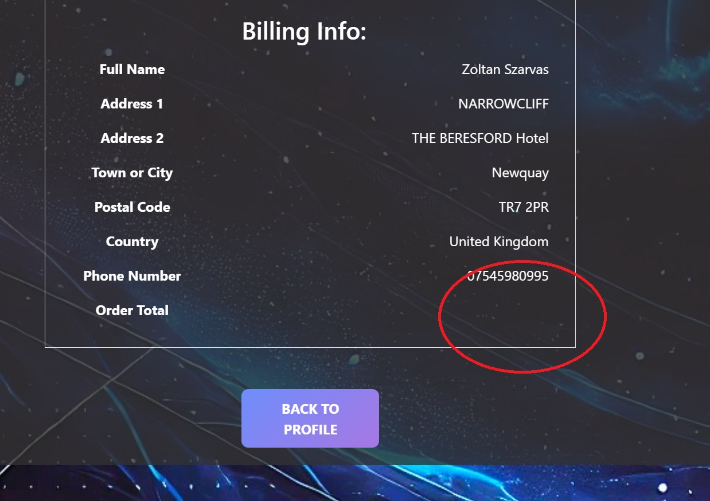

# TABLE OF CONTENT

1. [ Manual Testing ](#manual)
2. [ Automated Testing ](#auto)
3. [ Bugs and Fixes ](#bugs)

# MANUAL TESTING 

### Testing Responsiveness

| **Feature** | **Test Method** | **Expectation** | **Outcome** |
|-------------|-----------------|-----------------|-------------|
| Header Responsivness | Developer Tools: 320px/375px/425px/768px/1024px/1440px | Fully Responsive Layout | PASS |
| Footer Responsiveness | Developer Tools: 320px/375px/425px/768px/1024px/1440px | Fully Responsive Layout| PASS |
| Home Page | Developer Tools: 320px/375px/425px/768px/1024px/1440px | Fully Responsive Layout| PASS |
| Portfolio Page | Developer Tools: 320px/375px/425px/768px/1024px/1440px | Fully Responsive Layout| PASS |
| Service Page | Developer Tools: 320px/375px/425px/768px/1024px/1440px | Fully Responsive Layout| PASS |
| Contact Page | Developer Tools: 320px/375px/425px/768px/1024px/1440px | Fully Responsive Layout| PASS |
| Service_details Page | Developer Tools: 320px/375px/425px/768px/1024px/1440px | Fully Responsive Layout| PASS |
| Bag Page | Developer Tools: 320px/375px/425px/768px/1024px/1440px | Fully Responsive Layout| PASS | 
| Checkout Page | Developer Tools: 320px/375px/425px/768px/1024px/1440px | Fully Responsive Layout| PASS | 
| Checkout_success | Developer Tools: 320px/375px/425px/768px/1024px/1440px | Fully Responsive Layout| PASS | 
| Profile Page | Developer Tools: 320px/375px/425px/768px/1024px/1440px | Fully Responsive Layout| PASS | 
| Project Page | Developer Tools: 320px/375px/425px/768px/1024px/1440px | Fully Responsive Layout| PASS | 
| About Page | Developer Tools: 320px/375px/425px/768px/1024px/1440px | Fully Responsive Layout| PASS |
| Tech Page | Developer Tools: 320px/375px/425px/768px/1024px/1440px | Fully Responsive Layout| PASS | 

### Testing Functionality of Buttons/Links

| **Feature** | **Test Method** | **Expectation** | **Outcome** |
|-------------|-----------------|-----------------|-------------|
| Navigation Links | Click each link | Route to relevent page | PASS |

### Testing Layout/Structure

| **Feature** | **Test Method** | **Expectation** | **Outcome** |
|-------------|-----------------|-----------------|-------------|

### Form Validation testing

| **Feature** | **Test Method** | **Expectation** | **Outcome** |
|-------------|-----------------|-----------------|-------------|

### Browser Testing

| **Feature** | **Test Method** | **Expectation** | **Outcome** |
|-------------|-----------------|-----------------|-------------|

### TESTING USER STORIES

| **Feature** | **Test Method** | **Expectation** | **Outcome** |
|-------------|-----------------|-----------------|-------------|

# AUTOMATED TESTING 

### HTML,CSS and JS validation

* HTML VALIDATION:    

W3C validators used for HTML and CSS and JsHint is used to validate JAvaScript.
    

* CSS VALIDATION: 
    

* JavaScript VALIDATION: 
    

## PEP8 , python validation:

## Lighthouse 

## Django Automated Tests

- Django's Testing library was used to test Projects's forms. Corresponding PEP8 validation listed in PEP8 section above. Each form was tested with 3 tests.

# Bugs and Fixes 

Bugs found/Minor fixes during development:

1. footer dosn't stay at the bottom of the view and displaced when content isn't filling in the entire view.

-   
 
 Image of issue 

    
    

- solution: set <footer> elements position to relative and then used javascript to posititon footer absolute to the bottom when content isn't filling in the view.

2. Displaced footer element when dropdown opens on smaller devices (tech.html).

-   
 
 Image of issue 

    
    

- solution: vh-100 bootstrap class removed has solved the issue.

3. Webhook handler did not work during development with local listener set up:

-   
 
 Image of issue 

    
    

-   
 
 Image of issue 

    
    

-   
 
 Image of issue 

    
    

-   
 
 Image of issue 

    
    

-   
 
 Image of issue 

    
    

- solution: after a throughout investigation where I checked my checkout views, urls and webhooks.py for errors followed by making sure the local listener is connected and listening on stripe and checking the events( where payments appeared succesfully) I eventually found that the stripe listener in the cli was triggered with an incorrect path.
The correct trigger is stripe listen --forward-to localhost:8000/checkout/stripe/webhook/ while during development the 
 stripe listen --forward-to localhost:8000/stripe/webhook/ path was used resulting in the 404 error.

4. Order confirmation page does not show the total cost of the order:

investigating this I found that a variable was called incorrectly.

-   
 
 Image of issue 

    
    

-   
 
 Image of issue 

    
    

- solution: order.total was changed to order.order_total to reference the variable correctly.

5. Home Page and Portfolio main sections are out of alignment and text overflowing on smaller devices:

-   
 
 Image of issue 

    
    

- solution: easy fix, bootstrap class applying padding was replaced by custom class and adjusted with media queries to suit all sizes.

6. Services page out of alignment not fully center.

- solution: overlapping bootstrap and css styles removed as well as unused div elements.

7. Service_details page increase and decrease button visually unapplealing:

-   
 
 Image of issue 

    
    

- solution: custom class written in base.css to improve the look.

8. Bag.html-s table is out of alignment on screens less than 768px.

- solution: added media quieries to fex responsiveness.