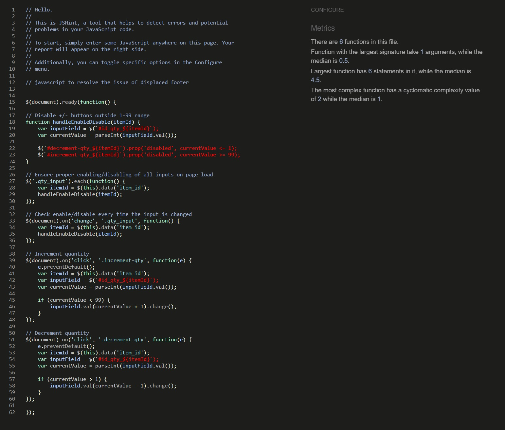

# TABLE OF CONTENT

1. [ Manual Testing ](#manual)
2. [ Automated Testing ](#auto)
3. [ Bugs and Fixes ](#bugs)

# MANUAL TESTING 

### Testing Responsiveness

| **Feature** | **Test Method** | **Expectation** | **Outcome** |
|-------------|-----------------|-----------------|-------------|
| Header Responsivness | Developer Tools: 320px/375px/425px/768px/1024px/1440px | Fully Responsive Layout | PASS |
| Footer Responsiveness | Developer Tools: 320px/375px/425px/768px/1024px/1440px | Fully Responsive Layout| PASS |
| Home Page | Developer Tools: 320px/375px/425px/768px/1024px/1440px | Fully Responsive Layout| PASS |
| Portfolio Page | Developer Tools: 320px/375px/425px/768px/1024px/1440px | Fully Responsive Layout| PASS |
| Service Page | Developer Tools: 320px/375px/425px/768px/1024px/1440px | Fully Responsive Layout| PASS |
| Contact Page | Developer Tools: 320px/375px/425px/768px/1024px/1440px | Fully Responsive Layout| PASS |
| Service_details Page | Developer Tools: 320px/375px/425px/768px/1024px/1440px | Fully Responsive Layout| PASS |
| Bag Page | Developer Tools: 320px/375px/425px/768px/1024px/1440px | Fully Responsive Layout| PASS | 
| Checkout Page | Developer Tools: 320px/375px/425px/768px/1024px/1440px | Fully Responsive Layout| PASS | 
| Checkout_success | Developer Tools: 320px/375px/425px/768px/1024px/1440px | Fully Responsive Layout| PASS | 
| Profile Page | Developer Tools: 320px/375px/425px/768px/1024px/1440px | Fully Responsive Layout| PASS | 
| Project Page | Developer Tools: 320px/375px/425px/768px/1024px/1440px | Fully Responsive Layout| PASS | 
| About Page | Developer Tools: 320px/375px/425px/768px/1024px/1440px | Fully Responsive Layout| PASS |
| Tech Page | Developer Tools: 320px/375px/425px/768px/1024px/1440px | Fully Responsive Layout| PASS | 

### Testing Functionality of Buttons/Links

| **Feature** | **Test Method** | **Expectation** | **Outcome** |
|-------------|-----------------|-----------------|-------------|
| Navigation Links - Home | Click on link | Route to relevent page | PASS |
| Navigation Links - Portfolio | Click on link | Route to relevent page | PASS |
| Navigation Links - Services | Click on link | Route to relevent page | PASS |
| Navigation Links - Contact | Click on link | Route to relevent page | PASS |
| Navigation Links - Accounts | Click on link/icon | Route to relevent page | PASS |
| Navigation Links - Shopping Bag | Click on link/icon | Route to relevent page | PASS |
| Accounts Link/Icon suboption - MyProfile | Click on link | Route to relevent page | PASS |
| Accounts Link/Icon suboption - Login | Click on link | Route to relevent page | PASS |
| Accounts Link/Icon suboption - Logout | Click on link | Route to relevent page | PASS |
| Accounts Link/Icon suboption - Register | Click each link | Route to relevent page | PASS |
| Home - Services | Click on link | Route to relevent page | PASS |
| Home - Portfolio | Click on link | Route to relevent page | PASS |
| Home - Contact | Click on link | Route to relevent page | PASS |
| Portfolio - Project | Click on link | Route to relevent page | PASS |
| Portfolio - About | Click on link | Route to relevent page | PASS |
| Portfolio - Tech | Click on link | Route to relevent page | PASS |
| Service - Each uploaded image | Click on each uploaded Service | Take to service_details | PASS |
| Service_details - Image | Click on Service image | open image in new tab | PASS |
| Service - back | Click on button | Take back to services | PASS |
| Service - add to bag | Click on button | add item to shopping cart | PASS |
| Projects - view repo | Click on button | take to relevent github repo | PASS |
| Projects - view project | Click on button | take to live project website | PASS |
| Projects - comments | Click on button | expand div to display comments | PASS |
| Projects - edit | Click on button | edit an existing comment | PASS |*
| Projects - delete | Click on button | delete comment | PASS |
| Projects - post comment | Click on button | content written in form is posted as comment | PASS |
| About - email link | Click on link | open up blank email addressed to my e-mail | PASS |
| About - linkedin link | Click on link | open up LinkedIn | PASS |
| Bag - keep shopping | Click on button | back to services | PASS |
| Bag - secure checkout | Click on button | proceed to checkout | PASS |
| Bag - decrease quantity button | Click on button | decrease amount displayed | PASS |
| Bag - increase quantity | Click on button | increase amount displayed | PASS |
| Bag - update | Click on button | update quantity, total | PASS |
| Bag - remove | Click on button | remove item from shopping cart | PASS |
| Checkout - adjust bag | Click on button | take back to shopping cart | PASS |
| Checkout - complete order | Click on button | process payment provided form validation passed | PASS |
| Footer - email | clcik on e-mail address | open email , ready to be sent to addresee | PASS |
| Footer - icons | click on each icon | open it in new tab | PASS |
| Footer - CV | click on download icon | download CV | PASS |

-*: edit button dosen't automatically takes the user back to the comment, however feature is functonal - listed for future upgrade

### Form Validation testing

| **Feature** | **Test Method** | **Expectation** | **Outcome** |
|-------------|-----------------|-----------------|-------------|
| Contact Form | Enter invalid input: No Title | No submission allowed - "Please fill in this field response" | PASS |
| Contact Form | Enter invalid input: No Content | No submission allowed - "Please fill in this field response" | PASS |
| Contact Form | Enter valid input | Submission allowed - "confirmation feedback" | PASS |
| Service_details - quantity input | click decrease/increase to reach 0/100 | no change in input | PASS |
| Service_details - quantity manual input | Enter invalid input | quantity autoatically adjusted to an accepted value | PASS |
| bag.html - quantity input | click decrease/increase to reach 0/100 | no change in input | PASS |
| bag.html - quantity manual input | Enter invalid input | quantity autoatically adjusted to an accepted value | PASS |
| Checkout.html Form | No input in fields/test them all individually | No submission allowed - "Please fill in this field response" | PASS |
| Checkout.html Card | no input | No submission allowed - "Your card number is incomplete" | PASS |
| Checkout.html Card | no date input | No submission allowed - "Your expiry date is incomplete" | PASS |
| Checkout.html Card | no security code input | No submission allowed - "Your security code is incomplete" | PASS |
| Checkout.html Card | no post code input | No submission allowed - "Your postal code is incomplete" | PASS |

### Browser Testing

| **Feature** | **Test Method** | **Expectation** | **Outcome** |
|-------------|-----------------|-----------------|-------------|
| Google Chrome | non scripted test of features on desktop | full functionality and compatibility with browser | PASS |
| Google Chrome | non scripted test of features on mobile | full functionality and compatibility with browser | PASS |
| Microsoft Edge | non scripted test of features on desktop | full functionality and compatibility with browser | PASS |
| Microsoft Edge | non scripted test of features on mobile | full functionality and compatibility with browser | PASS |
| Samsung Internet | non scripted test of features on mobile | full functionality and compatibility with browser | PASS |

### TESTING USER STORIES

| **Feature** | **Test Method** | **Expectation** | **Outcome** |
|-------------|-----------------|-----------------|-------------|

# AUTOMATED TESTING 

### HTML,CSS and JS validation

* HTML VALIDATION:    

W3C validators used for HTML and CSS and JsHint is used to validate JAvaScript.
    

* CSS VALIDATION: 
    
-   
 
 base.css 

    
    

-   
 
 checkout.css 

    
    

* JavaScript VALIDATION: 

-   
 
 base.html 

    
    

    1. JSHint does not inherently know about Bootstrap, so it assumes bootstrap is an undeclared variable.

-   
 
 base.js 

    
    

-   
 
 quantity_input_script.html 

    
    

-   
 
 quantity_input_script.html / additional js added to handle manual inputs 

    
    

-   
 
 project.html 

    
    

-   
 
 stripe_elements.js 

    
    

    1. Stripe JS Library link is included in base.html

-   
 
 bag.html 

    
    

    

## PEP8 , python validation:

## Lighthouse 

## Django Automated Tests

- Django's Testing library was used to test Projects's forms. Corresponding PEP8 validation listed in PEP8 section above. Each form was tested with 3 tests.

# Bugs and Fixes 

Bugs found/Minor fixes during development:

1. footer dosn't stay at the bottom of the view and displaced when content isn't filling in the entire view.

-   
 
 Image of issue 

    
    

- solution: set <footer> elements position to relative and then used javascript to posititon footer absolute to the bottom when content isn't filling in the view.

2. Displaced footer element when dropdown opens on smaller devices (tech.html).

-   
 
 Image of issue 

    
    

- solution: vh-100 bootstrap class removed has solved the issue.

3. Webhook handler did not work during development with local listener set up:

-   
 
 Image of issue 

    
    

-   
 
 Image of issue 

    
    

-   
 
 Image of issue 

    
    

-   
 
 Image of issue 

    
    

-   
 
 Image of issue 

    
    

- solution: after a throughout investigation where I checked my checkout views, urls and webhooks.py for errors followed by making sure the local listener is connected and listening on stripe and checking the events( where payments appeared succesfully) I eventually found that the stripe listener in the cli was triggered with an incorrect path.
The correct trigger is stripe listen --forward-to localhost:8000/checkout/stripe/webhook/ while during development the 
 stripe listen --forward-to localhost:8000/stripe/webhook/ path was used resulting in the 404 error.

4. Order confirmation page does not show the total cost of the order:

investigating this I found that a variable was called incorrectly.

-   
 
 Image of issue 

    
    

-   
 
 Image of issue 

    
    

- solution: order.total was changed to order.order_total to reference the variable correctly.

5. Home Page and Portfolio main sections are out of alignment and text overflowing on smaller devices:

-   
 
 Image of issue 

    
    

- solution: easy fix, bootstrap class applying padding was replaced by custom class and adjusted with media queries to suit all sizes.

6. Services page out of alignment not fully center.

- solution: overlapping bootstrap and css styles removed as well as unused div elements.

7. Service_details page increase and decrease button visually unapplealing:

-   
 
 Image of issue 

    
    

- solution: custom class written in base.css to improve the look.

8. Bag.html-s table is out of alignment on screens less than 768px.

- solution: added media quieries to fex responsiveness.